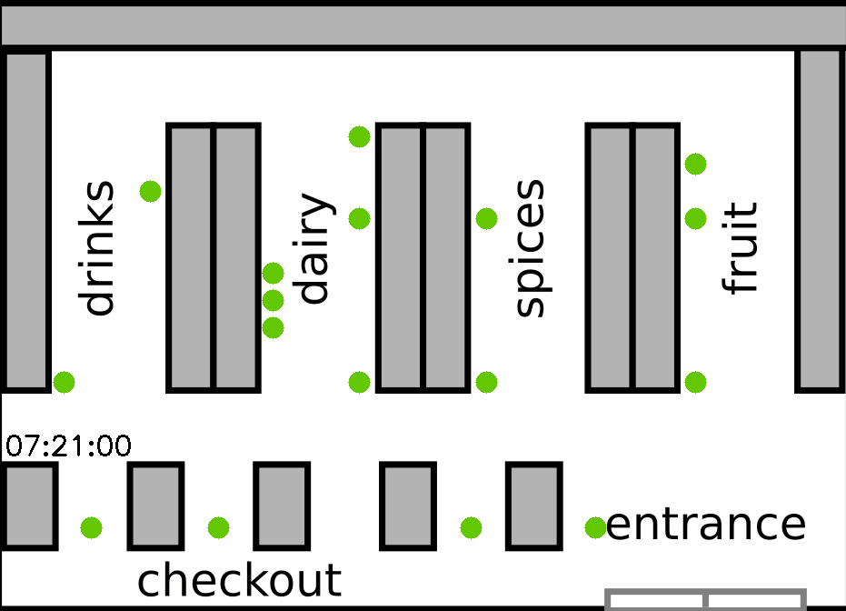

# Supermarket Simulation
Analyzes existing customer data, generates and visualizes new customer shopping behaviour.

## Main Components
- supermarket_analysis_processing.py:
  - EDA of original customer data and generating info to be used in the simulation.
- supermarket_simulation.py:
  - generation and visualization of new customer shopping behaviour.
